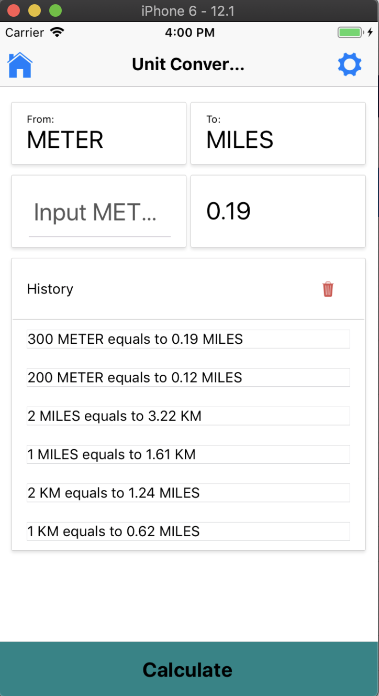

## Unit Converter React Native app

### Almost as simple as it gets mainly for demonstration and practice 

### Nativebase aka boostrap for react native

### Redux state management

### Persisting state in AsyncStorage

